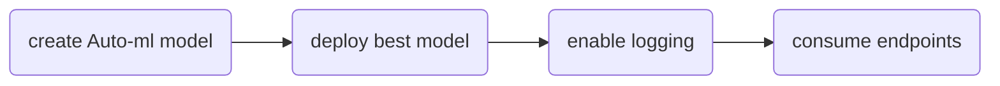

# Project 2
## Overview
This project demonstrates the process of deploying an Auto-ML model both manually and via an Azure pipeline. Additionally, we explore the details of the deployment via swagger as well as testing endpoints outside of the network.
## Architectural Diagram

## Improvements
This project could be improved by allowing autoML to run for longer ensuring a better model is found. 

## Screenshots

### Step 2a: Register dataset
dataset is registered and available for use

### Step 2b: Expirement Completed
Experiment has been completed, meaning the best model exists and can be further developed upon.

### Step 2c: Demonstrating best model
Here, you can see the best model I was referring to in step 2. In this case, it is VotingEnsemble

### Step 4a: Enable application insights
In this step I enabled application insights via python as seen through the valid URL.

### Step 4b: Logs example
Here, you can see my logs capturaing data after hooking in through the newly created insights URL.

### Step 5a: Swagger example
Here, you can see swagger running on my localhost. I've included HTTP API methods and responses.

### Step 6a: Endpoint.py running
Here, you can see the endpoint.py script running against the API in swagger. The response we are expecting is in JSON and is the result of running this example through our best model

### Additional screenshots demonstrating setup infrastructure

## Video demo
https://imgur.com/G2giBu1

