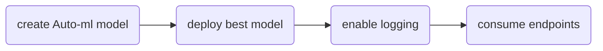

# Project 2
## Overview
This project demonstrates the process of deploying an Auto-ML model both manually and via an Azure pipeline. Additionally, we explore the details of the deployment via swagger as well as testing endpoints outside of the network.
## Architectural Diagram

## Improvements
This project could be improved by allowing autoML to run for longer ensuring a better model is found. 

## Screenshots
Refer to screenshot folder in repo

## Video demo
